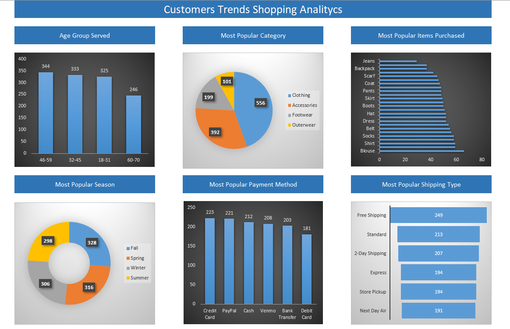
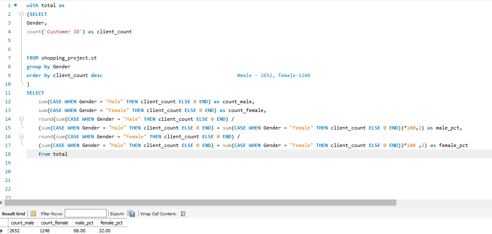
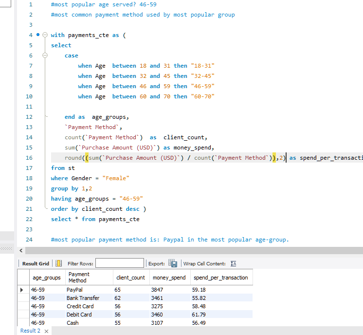

# Sales Analysis Project

## Overview

This project was created to analyze sales data using Excel and SQL, with a focus on various Key Performance Indicators (KPIs). The initial observation revealed that only 32% of buyers were women. Consequently, the analysis was centered on understanding the reasons behind this gender-based distribution, particularly in relation to income levels. The goal was to identify ways to increase sales by tailoring strategies specifically for female customers.

## Key Insights

In the detailed report, the following aspects were explored:

- **Age Groups:** The most prevalent age group was found to be 46-59 years old.
- **Popular Purchase Categories:** Clothing emerged as the most popular category, followed by an in-depth analysis of specific types of clothing purchased.
- **Seasonal Trends:** Examination of the most popular seasons for shopping.
- **Payment and Delivery Methods:** Insights into preferred payment methods and delivery options.

## Methodology

SQL was primarily employed for data cleaning, obtaining relevant KPIs, and conducting calculations. This initial use of SQL allowed for the identification of gender-based disparities, which were subsequently utilized for a more in-depth analysis.

## Dashboard

The project culminated in the creation of a dashboard that visually presents all the metrics in a comprehensible format. This dashboard serves as a centralized hub for monitoring and understanding sales performance.

